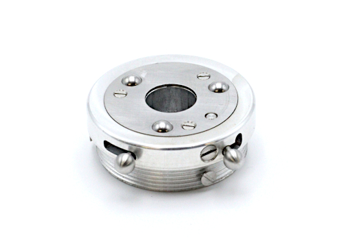

# Universal wrist & Tools holders

This repository contents documentation of : 

- **The Universal Wrist** : a mechanical wrist and his mechanical tool-holder. The wrist fits into a socket for quick connection-disconnection of different terminal devices such as the [ORTHOPUS Work Hook or the Aesthetic Hand](https://orthopus.com/en/upper-limb-prosthetics/).
- **Tool holders** : compatible with the ORTHOPUS Universal Wrist. For now you can already find a 3D printer version. 

## WARNING NOTICE BEFORE STARTING

The versions of our solutions reproduced in Do It Yourself do not have the CE marking. It can only be apply to solutions developed and sold by ORTHOPUS which follow the regulations in force.
ORTHOPUS cannot guarantee the “quality” of solutions replicated by third parties thanks to documentation shared on github.

## UNIVERSAL WRIST

### D.I.Y Level **⭐⭐⭐⭐⭐**

**Required components:** to make your own Universal Wrist, you will need advanced workshop machinery and some basics components (you will find a more detailed list of equipment in the **[making manual](./docs/wrist/UniversalWrist_making-manual.md)**

**How to make your own:** The Bill of Material shown below and available with clickable links [here](https://github.com/orthopus/01-wrist/blob/main/src/Wrist/ILL-0109-BoMGitHub.pdf) details standard components as well as parts that need to be machined.

To make your own Universal wrist, follow the **[making manual](./docs/wrist/UniversalWrist_making-manual.md)**.

## TOOL HOLDER 3D PRINTED

### D.I.Y Level **⭐⭐**

**Required components:** To make your own Tool Holder, you will need a 3D printer, a grinder machine or a metal file, and some basics screws (you will find a detailed list of equipment in the **[making manual](./docs/tool-holder-3D-printer/ToolHolder_3D_making-manual.md)**

**How to make your own :** We will give more details about how to get the best experiences with the **Tool Holder** in the *user manual* (upcoming file)**.**

You can make the Tool holder for less than 1€ : more details in the Bill of Material shown below and available with clickable links [here](https://github.com/orthopus/01-wrist/blob/main/src/Tool-holder%203D%20print/ILL-0109-DIYAttachementPlateBoM.pdf).

To make your own Tool Holder 3D printer, follow the **[making manual](./docs/tool-holder-3D-printer/ToolHolder_3D_making-manual.md)**.

## CONTRIBUTION

Your contribution to these projects is welcome!

* Have you discovered a bug or you have an improvement ideas ?
  
  * Go to the GitHub [issues](https://github.com/orthopus/01-wrist/issues) of the project.
  
* You have time, some Maker skills and you want to help us ?

  * If you need to make some modifications, our Fusion 360 source files are available on request, don’t hesitate to ask us!

  * Read the [CONTRIBUTING](CONTRIBUTING.md) file to help us to upgrade this project

  * Read the [CODEOFCONDUCT](CODEOFCONDUCT.md) file to know community standards

    

## CONTACT

If you wish to contact us, you can send a message to contact@orthopus.com
