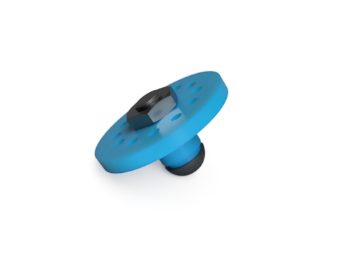
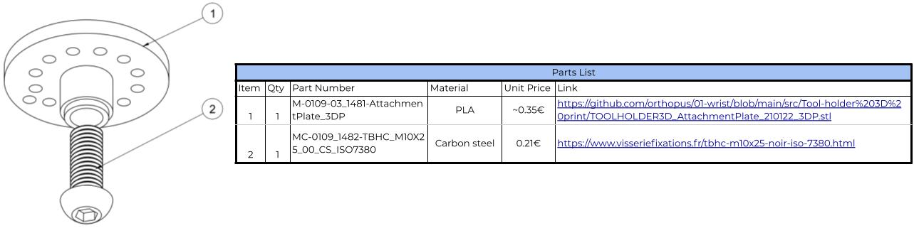

# Universal wrist & Tools holders

This repository contents documentation of : 

- ➡ **The Universal Wrist** : a mechanical wrist and his mechanical tool-holder. Adapted to upper-limb amputations including disarticulation of the  wrist, this mechanical wrist fits directly into a socket and connects quickly to a large number of terminal devices such as the [ORTHOPUS Work Hook or the Aesthetic Hand](https://orthopus.com/en/upper-limb-prosthetics/). *You can find [buying informations on this page](https://orthopus.com/en/universal-wrist/).*

  
  

- ➡ **Tool holders** : compatible with the ORTHOPUS Universal Wrist. For now you can already find a 3D printer version, usable with [mechanicals tools for upper limb amputees](https://github.com/orthopus/01-mechanicals-tools). *Scroll below to see the tool holder's documentation.*
  
  

  

>#### WARNING NOTICE BEFORE STARTING
>The versions of our solutions reproduced in Do It Yourself do not have the CE marking. It can only be apply to solutions developed and sold by ORTHOPUS which follow the regulations in force. ORTHOPUS cannot guarantee the “quality” of solutions replicated by third parties thanks to documentation shared on github.

## UNIVERSAL WRIST

#### HOW TO MAKE YOUR OWN UNIVERSAL WRIST

***D.I.Y difficulty level :* ⭐⭐⭐⭐⭐**

To make your own Universal Wrist, you will need advanced workshop machinery and some basics components. You can find a detailed list of equipment and the steps to follow in the **[UNIVERSAL WRIST MAKING MANUAL](./docs/wrist/UniversalWrist_making-manual.md)**)

The Bill of Material shown below and available with clickable links [here](https://github.com/orthopus/01-wrist/blob/main/src/Wrist/ILL-0109-BoMGitHub.pdf) details standard components as well as parts that need to be machined.

We will more details about how to get the best experiences with the **Universal Wrist** in the [INSTRUCTIONS FOR USE](https://orthopus.com/wp-content/uploads/2021/06/IFU-OR-0109-Universal-Wrist-ORTHOPUS-Instructions-For-Use.pdf).

## TOOL HOLDER 3D PRINTED

#### HOW TO MAKE YOUR OWN  TOOL HOLDER 3D PRINTED

***D.I.Y difficulty level :* ⭐⭐**

To make your own Tool Holder, you will need a 3D printer, a grinder machine or a metal file, and some basics screws. You can find a detailed list of equipment and the steps to follow in the **[TOOL HOLDER 3D PRINTED MAKING MANUAL](./docs/tool-holder-3D-printer/ToolHolder_3D_making-manual.md)**

You can make the Tool holder for less than 1€ : more details in the Bill of Material shown below and available with clickable links [here](https://github.com/orthopus/01-wrist/blob/main/src/Tool-holder%203D%20print/ILL-0109-DIYAttachementPlateBoM.pdf).

## CONTRIBUTION

Your contribution to these projects is welcome!

* Have you discovered a bug or you have an improvement ideas ?
  
  * Go to the GitHub [issues](https://github.com/orthopus/01-wrist/issues) of the project.
  
* You have time, some Maker skills and you want to help us ?

  * If you need to make some modifications, our Fusion 360 source files are available on request, don’t hesitate to ask us!

  * Read the [CONTRIBUTING](CONTRIBUTING.md) file to help us to upgrade this project

  * Read the [CODEOFCONDUCT](CODEOFCONDUCT.md) file to know community standards

    

## CONTACT

If you wish to contact us, you can send a message to contact@orthopus.com
