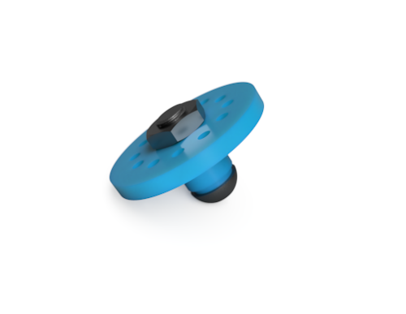
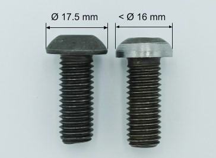

# Tool holder 3D printer : Making Manual

In this manual, you will find all the resources to design the Tool Holder 3D printer. 

:warning:  ***Warning*** :warning: 

For each tool, such as [the pick or tennis ball holders](https://github.com/orthopus/01-mechanicals-tools), a tool holder is required. This assembly manual only details how to make a tool holder which will be required to connect a tool to the universal wrist. 

### **List of Equipment**

**To design the Tool Holder you will need :**

- A 3D Printer
- PLA type filament
- A screw (TBHC M10 x 25 mm, Stainless Steel A2, ISO 7380)
- A bolt (Hm M10, zinc plated, DIN439)

**Tools :** 

- A grinding machine or a metal file 
- Drill or screwdriver and drill bits
- An Allen key (size 6)

### **The 3D Printed Body**

The base body of the **Tool Holder** will house the screw that will allow the Tool Holder to clip on the Wrist. It will also allow the indexed rotation of the tool in the wrist thanks to the 12 small holes arranged in a circle.

The .STL file of the 3D printed body is available here.

We used the Ultimaker Cura slicer and an Ultimaker Extended 2+ 3D printer.

Following parameter were used:

- Layer height: 0.15 mm

- Infill density: 50%

- Print speed: 50 mm/s

- Fan speed: 100%

- Build plate adhesion type: Brim
  
  

### **Machining Process**

The screw does not have the right head outer diameter to go through the universal wrist inner bore. You will have to reduce this diameter by grinding the head or file it. The goal is to reach an external head diameter smaller than 16 mm. 

### **Assembly** 

To assemble the Tool Holder 3D Printed, simply insert the modified M10 screw into the 3D printed body. Accordingly to which tool you will be connecting to the Tool Holder 3D Printed, further assembly instructions will be provided.