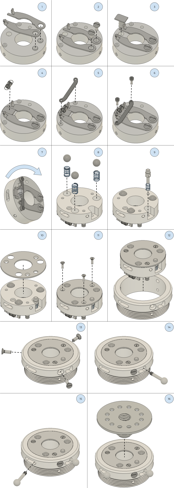

# Universal Wrist : Making Manual

In this manual you will find information to help you understand in details how is made the ORTHOPUS Universal Wrist so you can make it yourself (modern machine shop workstations required), directly with a manufacturer or simply repair/upgrade it yourself.

### **List of parts**

On the following picture, you can find an exploded view showing all the parts of the Universal Wrist. In the table, links allow you to find where components can be purchased or, for the machined ones, where we are manufacturing them. You can download the ***Bill of Material stored [here](https://github.com/orthopus/01-wrist/blob/main/src/Wrist/ILL-0109-BoMGitHub.pdf) to get clickable links.***

### **Manufacturing**

🧐 *Tip : open the image in a new tab to view the Tennis Ball Holder in Fusion 360 viewer*

Manufacturing the Universal Wrist requires advanced knowledge and machinery such as lathe, milling and drilling machines, etc... However, if you have all the required machinery, with the .STEP files [available here](https://github.com/orthopus/01-wrist/blob/main/src/Wrist/PRD-0109-1xxx_C-Wrist_v1.4.4.step) and the drawings [available here](https://github.com/orthopus/01-wrist/blob/main/src/Wrist/DRW-0109-1xxx-Wrist_Drawing_C.pdf) of the Universal Wrist, you should be able to make your own.

ORTHOPUS has chosen [Menetou Mécanique](https://www.menetoumecanique.com/) to manufacture in France 100% of its Universal Wrist.

### **Assembly**

**List of required equipment**

- A 0.5 flat screwdriver
- A 0.8 flat screwdriver
- A 1.5 hex key
- Threadlocking adhesive 

**Instructions**

With the picture below, you should be able to fully assemble or disassemble the Universal Wrist. To screw the M2 screws of the retaining bar (step 6), please use 1.5 hex key. For the 3 countersunk M2 screws holding the cover plate, please use a 0.5 flat screwdriver and for the M3 ones (step 13) a 0.8 flat screwdriver. Please use threadlocking adhesive to lock the screws when you are screwing them (steps 2, 6, 11, 13, 14, 15).

